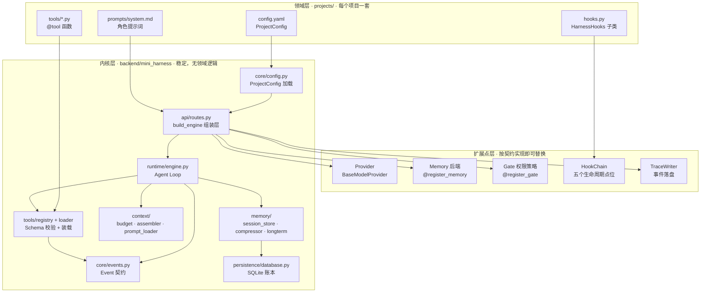

# 03 - 架构总览

## 1. 三层结构



依赖方向是单向的：**领域层可以引用内核，内核永远不引用领域**。组装层 `build_engine()` 是唯一焊接点——它读 `ProjectConfig`、反射构造组件、注入引擎，自身不含任何业务判断。

## 2. 数据流

```
用户输入 "我的订单 SO2026001 到哪了？"
  │
  ├─ 1. 追加 user 消息到会话账本（SQLite）
  │
  ├─ 2. 对账：账本里有没有"已声明但没结果"的工具调用？
  │       有 → 先执行回填；需要审批且未批准 → 下发 approval_required 并挂起（run 结束）
  │
  ├─ 3. 预算检查：估算 token 超过阈值 → 压缩旧消息为摘要事件
  │
  ├─ 4. 组装上下文：system（框架级 + 项目级）→ 历史消息 → 长期记忆（尾部注入）
  │       组装结果先过 Hook.before_llm_call
  │
  ├─ 5. 调模型（流式）→ 逐块下发 delta 事件
  │
  ├─ 6. 模型要求调用工具？
  │       是 → 登记调用 → 回到第 2 步（新一轮 Turn）
  │          执行链路：Schema 校验 → 路径边界 → Hook 前置 → 权限裁决 → 执行 → Hook 清洗 → 回填
  │       否 → 写入账本 → turn_finished → run_finished
  │
  └─ 全程每个事件都可旁路写入 TraceWriter
```

挂起与恢复：需要审批时引擎**不会**带着未决调用继续调模型，而是立即结束本次 `run`，状态留在 SQLite 里。审批通过后调用 `resume()`，从第 2 步接着跑。

## 3. 为什么这样分层

模型的选型、工具清单、提示词、业务规则会不断变；而"调模型 → 校验工具 → 裁决权限 → 管预算"这套循环是不变量。让不变量沉淀在内核、让易变的进入 `projects/`，两者的焊接点只留组装层一处。结果是：换领域等于换配置与几个文件，换实现等于换一个注册过名字的类，内核始终不需要认识任何业务名词。代价是多了一层组装代码与一套配置约定——这比"每次改需求都动循环"划算。

## 4. 哪一层稳定，哪一层易变

| 层               | 目录                                                                             | 变更频率 | 谁能改     | 稳定性承诺                                             |
| ---------------- | -------------------------------------------------------------------------------- | -------- | ---------- | ------------------------------------------------------ |
| 内核             | `backend/mini_harness/`                                                        | 极低     | 框架维护者 | [contracts.md](contracts.md) 中的冻结接口不得破坏性变更 |
| 扩展点实现       | `projects/<name>/tools`、`hooks.py`，以及外部实现的 Provider / Memory / Gate | 中       | 项目开发者 | 由项目自己维护；内核按契约调用，不关心实现细节         |
| 领域配置与提示词 | `projects/<name>/config.yaml`、`prompts/`                                    | 高       | 项目开发者 | 字段契约见[06-configure.md](06-configure.md)            |
| 全局默认值       | `configs/default.yaml`                                                         | 低       | 框架维护者 | 字段只增不改语义                                       |
| 运行时数据       | `data/*.db`                                                                    | 持续     | 程序       | 表结构**不承诺**兼容，升级时允许重建             |

判断一个改动该放哪里，只问一句：**"这句话里有没有业务名词？"** 有，就放领域层；没有，才考虑内核。
