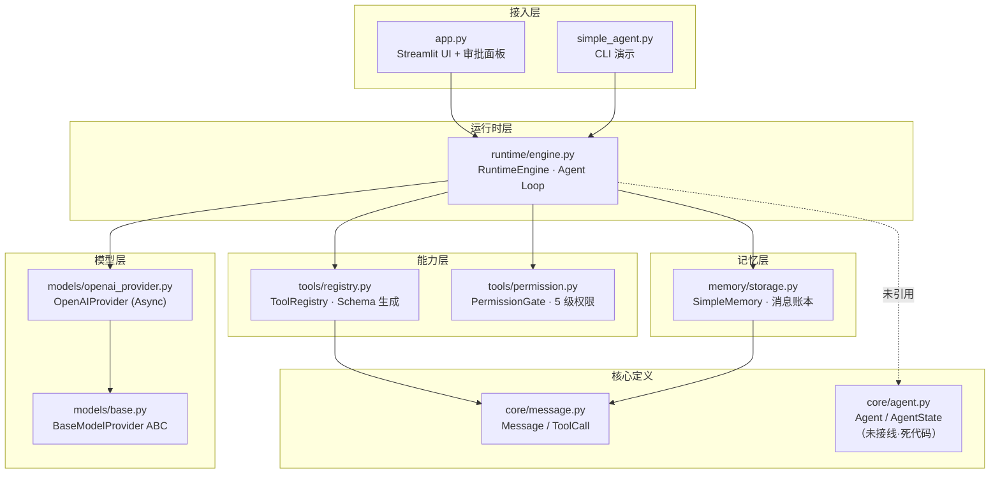
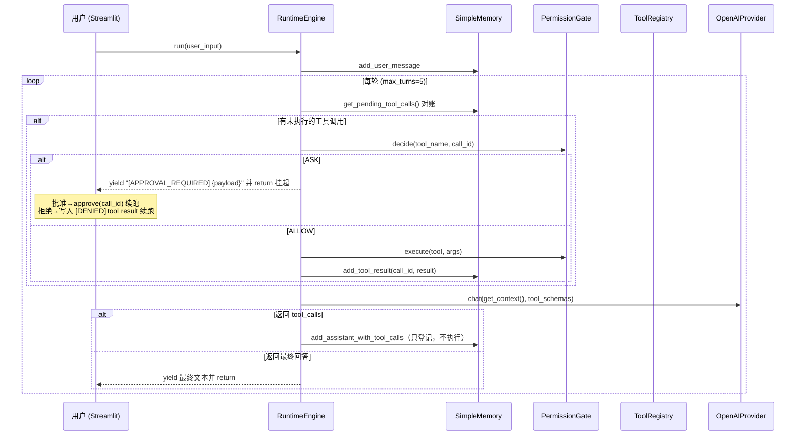

# MiniHarness 现状架构文档

> 对象：`E:\code\ai\harness_engineering_guide\scratch`（pyproject 包名 `scratch` v0.1.0）
> 参考体系：《智能体 Harness 工程指南》<https://yeasy.gitbook.io/harness_engineering_guide>（MiniHarness 实战项目的教学实现）
> 生成日期：2026-09-22 · 代码基线：595 行 Python（排除 `.venv` / `__pycache__` / `egg-info`）

---

## 1. 项目定位

本项目是《智能体 Harness 工程指南》配套的最小可运行 Agent Harness（MiniHarness 教学实现），用 **Python 3.11 + uv** 管理依赖，覆盖了 Harness 最核心的一条闭环：**模型调用 → 工具登记 → 权限审批 → 工具执行 → 结果回填 → 继续推理**。

- 技术栈：`openai`（AsyncOpenAI，兼容任何 OpenAI 协议端点，可指向 DeepSeek 等）、`python-dotenv`、`streamlit`；dev 依赖 `pytest` / `pytest-asyncio`（已配置 `asyncio_mode=auto`，但尚无测试目录）。
- 两个入口：
  - `simple_agent.py` —— 最小 CLI 演示（echo / get_time 两个工具）。
  - `app.py` —— Streamlit Web UI，带人工审批面板（echo / get_time / delete_file 模拟删除）。

## 2. 分层结构与数据流

一次带工具调用的请求流程：

**设计亮点：登记与执行分离。** 模型返回的 tool_calls 只写入 memory（登记），回到循环开头由 pending 对账统一裁决执行——这使"审批挂起/恢复"成为可能：`ASK` 时直接 `yield` 审批事件并 `return`，工具调用留在 memory 中等下一轮对账（`get_pending_tool_calls` 通过"已声明 vs 已有结果"的差集实现），批准后不带 `user_input` 续跑即可无缝恢复。这是整个代码库最有工程价值的机制。

## 3. 模块清单与职责

| 模块 | 行数 | 职责 | 状态 |
|---|---|---|---|
| `runtime/engine.py` | ~85 | Agent Loop：pending 对账 → 权限裁决 → 工具执行 → 模型调用 → 终止判断；`max_turns` 保护 | ✅ 核心，可用 |
| `memory/storage.py` | ~80 | 内存消息账本；OpenAI 消息格式序列化；pending 工具调用对账 | ✅ 可用，无持久化 |
| `tools/registry.py` | ~110 | 工具注册；签名→JSON Schema 自动生成；allow_tools 白名单 / allowed_paths 目录限制（**未生效**）；执行原语 | ⚠️ 校验未接线 |
| `tools/permission.py` | ~65 | 5 级权限（`FULL_TRUST` / `AUTO_WITH_NOTIFICATION` / `ASK_FIRST` / `APPROVE_ALWAYS` / `MANUAL_ONLY`）→ 3 值决策（ALLOW/ASK/DENY）；call_id 粒度一次性批准 | ⚠️ 语义未落实 |
| `models/openai_provider.py` | ~60 | OpenAI 兼容异步调用；tool_calls 解析 + call_id 兜底 + JSON 参数容错 | ⚠️ 有调试泄漏 |
| `models/base.py` | ~20 | `BaseModelProvider` ABC + `ModelResponse` | ✅ |
| `core/message.py` | ~30 | `Message` / `MessageRole` / `ToolCall` 数据结构 | ✅ |
| `core/agent.py` | ~41 | `AgentState` 状态机 / `ExecuteResult` / `Agent` 定义 | ❌ 死代码，零引用 |
| `app.py` | ~190 | Streamlit 会话初始化、asyncio 桥接、事件解析、审批面板、历史渲染 | ✅ 可用 |
| `simple_agent.py` | ~35 | 最小 CLI 演示 | ✅ |

配置：`.env` 定义了 `LLM_API_KEY / LLM_BASE_URL / LLM_MODEL`、`OPENAI_API_KEY / OPENAI_BASE_URL / OPENAI_MODEL`、`MAX_TURNS / MAX_STEPS / EXECUTION_TIMEOUT_SECONDS / LOG_LEVEL` 共 10 项；**代码实际只读取 `OPENAI_*` 三项**，其余 6 项无任何引用（`max_turns` 在两处入口硬编码为 5）。

## 4. 关键机制详解

### 4.1 权限模型（tools/permission.py）

`PermissionLevel` 定义了 5 级，但 `decide()` 的实际行为只有三种路径：

| 声明级别 | 实际行为 | 差距 |
|---|---|---|
| `FULL_TRUST` | 直接 ALLOW | 符合声明 |
| `ASK_FIRST` | 首次 ASK，批准后该 call_id ALLOW | 符合声明 |
| `AUTO_WITH_NOTIFICATION` | 与 ASK_FIRST 完全相同（要批准） | ❌ 无"自动执行 + 通知"行为 |
| `APPROVE_ALWAYS` | 与 ASK_FIRST 完全相同（逐 call_id 批准） | ❌ 无"同类工具记住批准"语义 |
| `MANUAL_ONLY` | 直接 DENY | ❌ 语义错位：应为转人工，而非拒绝 |

批准是 **call_id 粒度的一次性白名单**（`approved_call_ids: Set[str]`），没有工具级/参数级的规则记忆。

### 4.2 工具执行的双路径问题

存在两个几乎相同的执行原语：

- `ToolRegistry.execute()` —— 查表 → `func(**arguments)` → 异常转字符串。
- `PermissionGate.execute()` —— 查表 → `func(**arguments)` → 返回 `(ok, result)` 元组。

引擎只调用后者；前者是冗余代码。更重要的是，**两者都没有调用 `_validate_params`（JSON Schema 参数校验）和 `_validate_path`（目录边界校验）**——白名单与路径沙箱的机制写了，但从未进入执行链路。当前工具执行 = 直接 `func(**arguments)`，模型幻觉出的未知参数会被 Python 直接抛 TypeError（被吞成错误字符串回给模型），越权路径无法拦截。

### 4.3 事件协议（引擎 ↔ UI）

引擎输出是**基于文本前缀的行协议**，UI 端按前缀解析：

- `[APPROVAL_REQUIRED] {json}` → 进入待审批队列
- `[Tool {name}] {result截断200字符}` → 工具日志
- 其他任何文本 → 视为最终回答

脆弱点：事件无类型/schema；`process_events` 里 `final_text` 会被后一条覆盖（多段最终文本只留最后一条）；若模型输出恰好以 `[Tool ` 或 `[APPROVAL_REQUIRED] ` 开头会被误分类。

### 4.4 上下文序列化的健壮性处理（做得好的细节）

`SimpleMemory.get_context()` 对 OpenAI 消息配对语义处理得比较细：

- assistant 带 tool_calls 且 content 为空时，**完全省略 content 键**（不传 `null`，注释明确标注这是关键）；
- tool 消息必须带 `tool_call_id`，否则丢弃（避免孤儿 tool 消息导致 API 400）；
- `openai_provider` 对模型返回的 call_id 做了 uuid 兜底，参数 JSON 解析失败退 `{}`。

这些是实际踩坑后沉淀的兼容性处理，生产化时应保留。

### 4.5 UI 桥接方式

`app.py` 为每个 Streamlit 会话建一个 `asyncio.new_event_loop()`，用 `run_until_complete` 一次性收集引擎产出的**全部**事件再渲染——正确但无流式：用户在引擎运行期间只见 spinner，无增量输出。

## 5. 已知问题与缺口清单

### P0 —— 正确性与安全

| # | 问题 | 位置 | 影响 |
|---|---|---|---|
| 1 | 参数校验未接线：`_validate_params` 从未被调用 | tools/registry.py | 幻觉参数直接进入函数体 |
| 2 | 路径沙箱未接线：`_validate_path` / `allowed_paths` 从未被调用 | tools/registry.py | 路径类工具无目录边界 |
| 3 | 双执行路径冗余，且都无校验/超时/审计 | registry.execute vs gate.execute | 执行链路无单点收口 |
| 4 | 权限级别语义未落实（见 4.1 表） | tools/permission.py | 声明的信任级别与实际行为不符 |
| 5 | 工具同步执行阻塞事件循环，无超时（`EXECUTION_TIMEOUT_SECONDS` 未实现） | engine / permission | 慢工具卡死整个会话 |
| 6 | 调试 print 泄漏全部 messages 与事件流到 stdout | openai_provider / app / registry | 敏感上下文泄漏 + 日志噪声 |

### P1 —— 健壮性与能力缺口

| # | 问题 | 说明 |
|---|---|---|
| 7 | 模型调用无重试/退避/超时，异常直接抛出使引擎崩溃 | run() 无 try/except |
| 8 | 记忆无持久化，重启即失忆；无 token 预算与上下文压缩，长对话必然超限 | SimpleMemory 纯内存 |
| 9 | `max_turns` 耗尽只 yield 一句提示，pending tool calls 遗留，续跑行为不可预期 | runtime/engine.py |
| 10 | system prompt 无注入点（`MessageRole.SYSTEM` 已定义但无调用方） | 提示词工程无入口 |
| 11 | 非流式输出；`run_until_complete` 全量阻塞 | UI 体验差，长任务不可交互 |
| 12 | 事件协议为文本前缀解析，无类型、有覆盖/误判风险（见 4.3） | engine ↔ UI 契约脆弱 |
| 13 | 引擎不可重入：同一 engine 并发 run 会互相污染 memory；多会话仅靠 Streamlit session 隔离 | 无会话管理抽象 |
| 14 | `core/agent.py` 死代码：`AgentState`/`ExecuteResult`/`Agent` 定义完整但零引用 | 状态机意图未落地 |
| 15 | `.env` 6 项配置无引用，`max_turns` 硬编码 | 配置系统名存实亡 |

### P2 —— 工程质量

| # | 问题 | 说明 |
|---|---|---|
| 16 | 无任何测试（pytest 已配置、tests/ 不存在） | 回归无防护 |
| 17 | 无类型检查 / lint / CI 配置 | 质量门禁缺失 |
| 18 | 包名 `scratch` 为占位名；`examples/` 空包 | 可发布性为零 |
| 19 | 无可观测性：无结构化日志、无 trace、无指标（连 token 用量都未统计） | 线上不可运营 |
| 20 | 无工具结果治理：任意长度结果直接入 memory（引擎 yield 侧截断 200 字符仅影响显示） | 上下文易被撑爆 |

## 6. 扩展点现状

- ✅ `BaseModelProvider` ABC —— 可替换模型供应商，接口干净。
- ✅ `ToolRegistry.register` + 自动 Schema —— 加工具成本低（写个函数即可）。
- ❌ Memory / PermissionGate / RuntimeEngine 均为具体类无接口，替换实现需改引擎。
- ❌ 无插件机制、无 MCP、无多智能体编排（对应指南第 8-9 章内容未开始）。

## 7. 小结

现状是一个**逻辑正确、闭环完整的教学级 Harness**：Agent Loop 的"登记-审批-执行分离"设计有真实工程价值，OpenAI 消息配对细节处理成熟；但距离生产级还差四个量级的能力——**执行链路无安全收口（校验/沙箱/超时/审计全部缺失）、无持久化与恢复、无可观测性、无编排与生态扩展**。具体的生产化目标与目标架构见 [architecture_production.md](./architecture_production.md)。
