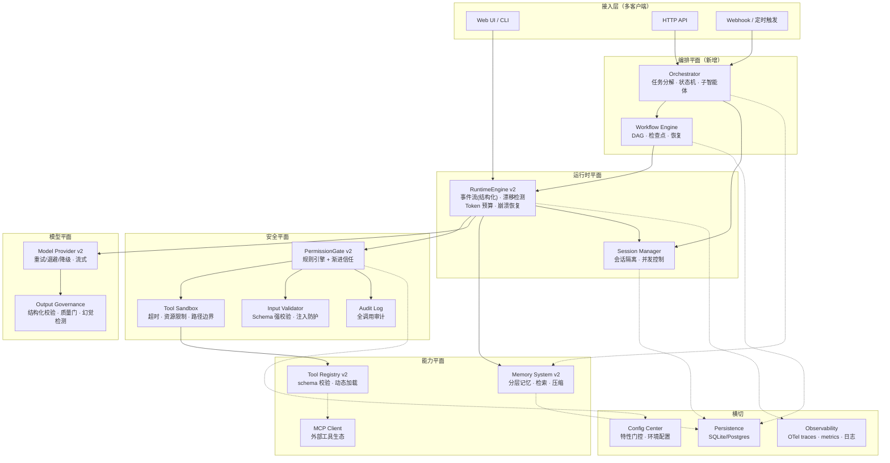
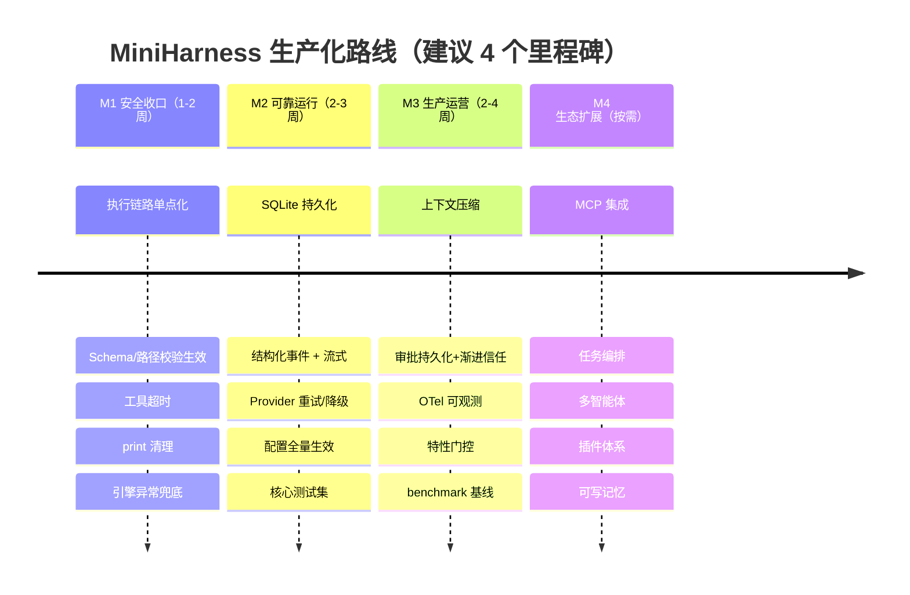

# MiniHarness 生产级目标架构文档

> 对象：`E:\code\ai\harness_engineering_guide\scratch`（MiniHarness 教学实现）的生产化演进目标
> 参考体系：《智能体 Harness 工程指南》<https://yeasy.gitbook.io/harness_engineering_guide> 及其剖析的三大生产参考系统（OpenAI Codex / Claude Code / OpenClaw）
> 生成日期：2026-09-22 · 配套现状文档：[architecture_current.md](./architecture_current.md)

---

## 1. 设计哲学与五大原则

《指南》给出的 Harness 工程五原则，直接作为生产化演进的决策准绳：

| 原则 | 含义 | 对本项目的落点 |
|---|---|---|
| 约束优先（Constraint-first） | 能力可以有缺口，行为必须有边界 | 工具默认 ASK_FIRST；路径/参数/资源先收紧再放开 |
| 可验证性（Verifiability） | 每个执行动作可复现、可审计、可回放 | 工具调用全量审计日志 + trace_id 贯穿 |
| 渐进信任（Progressive trust) | 信任是挣来的：观察 → 受限 → 授权 | 权限级别语义落实（4.2 节），支持"记住批准" |
| 故障假设（Design for failure) | 模型/工具/网络都会坏，恢复路径优先设计 | 重试/超时/断点恢复/降级为一级公民 |
| 智能体工效（Agent ergonomics） | 为"读结果的模型"设计工具返回 | 工具结果结构化 + 截断策略 + 错误可行动化 |

对照三大参考系统的架构取舍（指南第 1 章汇总表），MiniHarness 的生产定位建议对齐 **Claude Code 的任务型范式**（终端交互 + 权限模式 + 可扩展工作流），而非 OpenClaw 的常驻自驱型——除非业务需要后台自主运行，否则不必引入 Gateway 平面的复杂度。

## 2. 目标架构总览

与现状的本质差异：**执行收口**（所有工具调用必经 Validator → Gate → Sandbox 单一链路）、**状态外置**（memory/工作流状态落盘，进程可死可复活）、**平面解耦**（模型/工具/记忆/权限各自有接口契约，可独立替换）。

## 3. 各子系统目标设计

### 3.1 运行时引擎（RuntimeEngine v2）

| 能力 | 现状 | 目标 |
|---|---|---|
| 事件流 | 文本前缀行协议，UI 全量收集 | 结构化事件（TypedDict/pydantic：`TurnStarted / ToolRegistered / ApprovalRequested / ToolExecuted / TurnCompleted / Error / BudgetExceeded`），`yield dataclass`，UI 按 type 分发 |
| Agent Loop | pending 对账 + max_turns | 保留核心循环；增加：每轮后漂移检测（目标偏移评估）、轮次/Token 双预算、异常兜底（模型/工具异常转为 Error 事件而非崩溃） |
| system prompt | 无注入点 | 引擎构造 `messages = [system] + memory`，system prompt 由 Agent 配置提供，支持模板变量 |
| 并发 | 同 engine 并发 run 互相污染 | 每 run 一个 Session 上下文（session_id 贯穿），引擎无共享可变状态 |
| 恢复 | max_turns 耗尽后遗留 pending | 轮次耗尽时自动生成 tool 结果（"turn budget exhausted"）回填，保证消息序列合法；任意时刻进程崩溃后可从 checkpoint 恢复 |

### 3.2 工具层（Tool Registry v2 + Sandbox）

这是现状缺口最大、生产化优先级最高的子系统：

1. **执行收口**：删除 `ToolRegistry.execute` / `PermissionGate.execute` 双路径，收敛为 `ToolExecutor` 单点，流水线固定为：
   `查表 → 参数 Schema 强校验 → 路径边界校验 → 权限裁决 → 沙箱内执行（超时+资源限制）→ 结果治理 → 审计落盘`
2. **Schema 强校验**：启用 `_validate_params` 并补齐类型/枚举/长度校验（用 pydantic 或 jsonschema），校验失败返回结构化错误给模型（可行动：说明哪里错了），而非裸 TypeError。
3. **路径沙箱**：启用 `_validate_path`，作为文件类工具的强制依赖；resolve 后判断 `is_relative_to` 已实现，补符号链接解析与 UNC/盘符逃逸防护（Windows 环境重点）。
4. **执行超时**：工具统一 `asyncio.wait_for` 或线程池 + timeout（消费 `EXECUTION_TIMEOUT_SECONDS` 配置）；超时返回结构化超时结果，会话不死。
5. **结果治理**：结果按 token 预算截断（而非显示层 200 字符），大结果写旁路存储、memory 中留摘要 + 引用；返回结构统一 `{ok, data|error, meta}`。
6. **动态发现**：工具包 entry-point 自动注册 + allowlist 门控；预留 MCP 客户端挂载点（stdio / Streamable HTTP 两种传输，见指南第 9 章），MCP 工具与本地工具走同一权限/沙箱链路。

### 3.3 权限与安全（PermissionGate v2）

现状 5 级枚举名存实亡。目标把"声明级别"翻译成**可配置规则引擎**：

| 级别 | 目标语义 | 实现要点 |
|---|---|---|
| `FULL_TRUST` | 自动 ALLOW + 审计 | 维持 |
| `AUTO_WITH_NOTIFICATION` | 自动执行，异步通知 UI/渠道 | 引擎不挂起；发 notification 事件 |
| `ASK_FIRST` | 首次 ASK；批准后可选"记住同类" | 增加工具级+参数指纹粒度的持久化批准 |
| `APPROVE_ALWAYS` | 批准一次后同类调用永久 ALLOW | approved 集合按 `(tool, 参数模式)` 记忆，落盘 |
| `MANUAL_ONLY` | 引擎不执行，产出"转人工"任务并挂起 | 区分 DENY（拒绝并回填）与 HANDOFF（等人工执行后回填） |

配套安全机制（对应指南第 12 章威胁模型）：

- **提示注入防护**：工具结果作为不可信数据处理——结果文本进 memory 前做围栏标记（如 XML 包裹 + "内容来自工具"角色声明），关键工具（执行类）对结果中的指令样文本做告警。
- **审批 payload 防篡改**：审批对象带 call_id + 参数哈希，批准时校验参数未变。
- **密钥卫生**：`.env` 不入库，日志/审计/异常中自动脱敏 API key 与路径中的敏感段。
- **审计日志**：每次工具调用记录 `who(session)/when/what(tool,args哈希)/decision/结果元数据`，本地 SQLite 即可起步。

### 3.4 记忆与上下文（Memory v2）

对应指南第 6 章分层记忆架构，分四期落地：

1. **持久化**（P0）：`SimpleMemory` 后端化为 SQLite（消息表 + 会话表），接口抽象 `MemoryStore`，保留现有 `get_context` 的序列化健壮性细节（content 键省略、孤儿 tool 丢弃、call_id 兜底）。
2. **上下文组装**（P1）：`ContextAssembler` 按预算装配 `system + 摘要 + 近期消息 + 相关记忆检索`，取代"全量塞入"。
3. **压缩**（P1）：超预算时自动 compaction（旧轮次摘要化，保留最近 N 轮原文 + 全部未完成工具调用），对齐 Claude Code 的 compact 机制。
4. **可写记忆**（P2）：agent 可写长期记忆文件/库（用户偏好、项目事实），写入走权限门控。

### 3.5 模型层（Provider v2 + 输出治理）

- **可靠性**：指数退避重试（429/5xx/超时）、请求级 timeout、模型降级链（主模型失败切备用）、速率限制。
- **流式**：`chat_stream` 接口，token 增量经引擎转事件，UI 打字机效果；工具调用增量聚合。
- **输出治理**（指南第 7 章）：结构化输出模式（JSON Schema 约束 + 解析失败重试）、质量门（空输出/超长/敏感内容检查）、工具调用幻觉检测（调用了不存在的工具→返回可行动错误而非静默）。
- **成本可观测**：usage（prompt/completion tokens）从响应提取，进 metrics 与预算控制。

### 3.6 编排平面（新增，指南第 8 章）

教学版不需要，生产版按需引入两层：

- **任务编排**：`Task` 状态机（`PLANNED → RUNNING → WAITING_APPROVAL → DONE/FAILED/CANCELLED`），支持人工审批挂起/恢复（复用现有 pending 机制）、检查点持久化、超时取消。
- **多智能体**：Coordinator 模式（主智能体分解任务 → 子智能体执行 → 汇总），子智能体各自独立 memory 与预算，通信走结构化消息而非共享内存。

### 3.7 可观测性与配置（横切，指南第 10/11 章）

- **Observability**：OpenTelemetry 三件套——trace（一次 run 一条 trace，工具调用/模型调用为 span）、metrics（turn 数、token、工具延迟/失败率、审批等待时长）、结构化日志（替换所有 `print`，LOG_LEVEL 生效）。
- **配置中心**：`.env` 全部 10 项落地读取；分层配置（默认值 → 环境变量 → Agent 级覆盖）；特性门控（`FEATURE_MCP=on/off` 等）控制灰度上线。

## 4. 生产级 Harness 的验收清单

以"能上生产"为标准，按优先级给出目标基线（对应指南第 13 章评估方法论）：

### 4.1 正确性与安全（P0，上生产前必须）

- [ ] 所有工具调用经过单一执行链路（校验 → 权限 → 沙箱 → 审计），无旁路
- [ ] 参数 Schema 校验全量生效；路径类工具 100% 有目录边界
- [ ] 工具执行有超时上限；模型调用有超时 + 重试；引擎异常不崩溃、可恢复
- [ ] 权限五级语义与声明一致；审批可持久化、可审计；拒绝与转人工路径分离
- [ ] 无调试输出泄漏（print 清零，密钥脱敏）
- [ ] max_turns/Token 预算耗尽时行为确定：合法回填 + 明确终止事件

### 4.2 可靠性与可运营（P1）

- [ ] 会话与消息持久化；进程重启后可恢复进行中的任务
- [ ] 结构化事件协议（类型化事件替代文本前缀）；流式输出
- [ ] 上下文自动压缩，长会话不因 token 超限失败
- [ ] OTel trace + 核心指标 + 结构化日志
- [ ] 配置全量生效 + 特性门控

### 4.3 工程质量（P1）

- [ ] 测试体系：工具层单测（校验/权限/沙箱）、引擎 loop 集成测试（mock 模型）、审批挂起/恢复端到端测试、回归测试集
- [ ] 类型检查（pyright 已配置）+ lint + CI 门禁
- [ ] 包正名、模块边界清晰、public API 有 docstring
- [ ] 评估基线：固定任务集的端到端成功率/步数/token 成本 benchmark，防止演进退化

### 4.4 生态扩展（P2，按业务需要）

- [ ] MCP 客户端（stdio + HTTP），外部工具与本地工具同一安全链路
- [ ] 任务编排 + 多智能体 Coordinator
- [ ] 插件体系（工具包/子智能体/钩子三类扩展点）
- [ ] 可写长期记忆

## 5. 演进路线图

| 里程碑 | 交付判据 |
|---|---|
| M1 | 现状清单 P0 #1-6 全部关闭；delete_file 类危险工具在无审批时不可执行 |
| M2 | 杀进程重启后对话可续；模型断连自动恢复；测试覆盖率覆盖核心链路 |
| M3 | 千轮长会话稳定运行；全链路 trace 可查；审批记录可审计 |
| M4 | 外部 MCP 工具可挂载且有权限门控；多步任务可编排 |

## 6. 关键设计决策记录（建议）

| 决策 | 选择 | 理由 | 备选 |
|---|---|---|---|
| 语言/运行时 | 维持 Python | 与指南实战一致、团队栈、生态够用 | Rust（Codex 路线，性能强但成本高） |
| 持久化 | SQLite 起步 → Postgres | 单机零运维，接口抽象后可换 | 直接 Postgres（多租户时） |
| 事件协议 | 类型化 dataclass + pydantic 校验 | UI 契约明确、可演进 | 文本协议（现状，弃） |
| 权限模型 | 规则引擎 + 指纹记忆，非硬编码枚举 | 渐进信任可配置、可审计 | 纯枚举分支（现状，弃） |
| 沙箱 | 应用层沙箱（校验+超时+资源限制） | 跨平台（当前 Windows 环境） | OS 级沙箱（Bubblewrap/Seatbelt，Linux/macOS 部署时叠加） |
| 定位 | Claude Code 式任务型（按需启停） | 与教学代码形态最近、复杂度最低 | OpenClaw 式常驻自驱（需 Gateway 平面） |

---

一句话总结：**现状已把 Harness 最难的"审批挂起/恢复"骨架搭对了；生产化的主线是把安全（校验/沙箱/审计）、可靠（持久化/重试/恢复）、可运营（事件协议/可观测/预算）三件事逐一收口，再按需长出编排与生态。**
